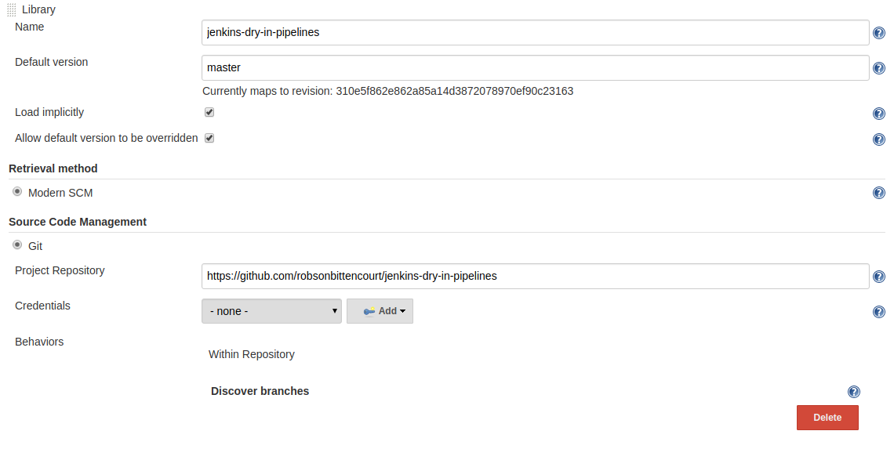

# Jenkins DRY in Pipelines

> In software engineering, don't repeat yourself (DRY) is a principle of software development aimed at reducing repetition of all kinds.


## Goal
The goal of this project is to provide useful generic functions to use with [Shared Libraries](https://jenkins.io/doc/book/pipeline/shared-libraries/) feature of Jenkins Pipelines. These functions are often common to many pipelines causing code replication. With this grouping of functions it is possible to eliminate duplications by making pipeline files simpler and leaner.

## How to use
It is necessary to import as functions of this project into your Jenkins. To do this, go to *Manage Jenkins » Configure System » Global Pipeline Libraries* and fill the following information.



If you prefer it's not necessary check *Load implicitly* option. If you don't use this option it will be necessary import manually this script using the following instruction in top of the Jenkinsfile.

```
@Library('jenkins-dry-in-pipelines') _
```

More details can be found [here](https://jenkins.io/doc/book/pipeline/shared-libraries/#using-libraries).

The examples in this repository assume that the option has been checked, so the imports are not displayed

## Available functions

| **Name**        | requestUserInputTag |
|-----------------|---------------------| 
| **Description** | Stop the pipeline execution and request to user inform a tag |    
| **Parameters**  | None |
| **Return**      | The selected tag |
| **Observation** | This function has a 10 minutes timeout. If a tag is not selected the pipeline is canceled | 

**Example of use:**

```
node {
    stage("Print tag") {
      def tag = requestUserInputTag()

      sh("echo ${tag}")
    }
}
```

## Contributing
If you have some function in your pipelines that you believe is generic enough feel free to submit a Pull Request.

In order to understand the operation of the scripts it is possible to observe the code of this project and the [documentation](https://jenkins.io/doc/book/pipeline/shared-libraries/#writing-libraries).

## Meta
Robson Bittencourt - @rluizv - robson.luizv@gmail.com

Distributed under the MIT license. See [LICENSE](LICENSE) for more information.

https://github.com/robsonbittencourt/jenkins-dry-in-pipelines